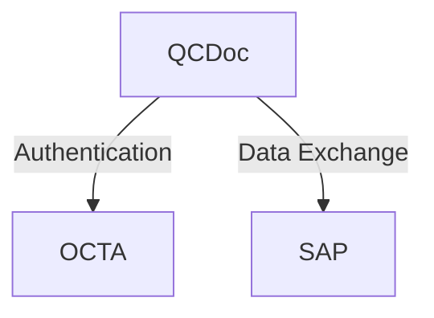

# C4 Context Diagram

```mermaid
graph TD
    A[QCDoc] -->|Authentication| B[OCTA]
    A -->|Data Exchange| C[SAP]
```

- **QCDoc**: The main application.
- **OCTA**: External system for authentication.
- **SAP**: External system for data exchange.
